# Detecting Disaster Tweets
## Determining whether a Tweet is About a Disaster 

**Authors**: Jeff Spagnola

The contents of this repository detail an analysis of the module one project. This analysis is detailed in hopes of making the work accessible and replicable.

**Note** 
3/4/2021 - I'm currently doing some updates on this project that will not currently be reflected in this ReadMe for now.  I will update the ReadMe with the updated results as soon as this is finished.  Check the associated notebook for the work-in-progress.  Thanks!  

<center>  </center>

### Business problem:
The ability to develop a system that can accurately determine the context of a tweet can be useful in many areas, especially for organizations in the news and security sectors. Social media outlets are increasingly becoming the primary place where news "breaks" and the ability to sift through the noise and find posts about catastropic events can lead to a much quicker response and a better concept of the details surrounding the situation.

Within this notebook, we will create a model that can act as a social media monitor that will take in a series of tweets and determine whether or not a tweet is in reference to an actual disaster. For example, we can use natural langauge processing to determine the difference between "There is a brush fire in Australia." and "The new Kenrick Lamar song is fire!"

### Data
The data was obtained from the <a href="https://www.kaggle.com/vstepanenko/disaster-tweets">Disaster Tweets dataset on Kaggle</a>.  The dataset contains over 11,000 tweets associated with disaster keywords such as "crash", "quarantine", "ablaze", and others.  All tweets were collected on Jan. 14th, 2020 and some of the topics collected were the eruption of Taal Volcano in Batangas, Phillippines, Coronavirus, Bushfires in Australia, and the downing of flight PS752. 

### Process
The data was analyzed using the OSEMN data science method and during this presentation we will walk through each step of this process as well as share the results.

## Methods
This was a very iterative process from start to finish.  We can break down the methods into three parts: basic NLP, Classifier Models, and Neural Networks.

### Basic NLP
After importing the data and trimming the dataset down to a text and target column, we were ready to begin cleaning up the text in order to perform some basic NLP.  First, we created a single corpus out of the text column.

```python
explore_df = df['text'].copy()
explore_text = ' '.join(explore_df)
explore_text

```
Next up, we performed some super basic Regex as well as made all words lowercase.

```python
pattern = "([a-zA-Z]+(?:'[a-z]+)?)"
explore_tokens_raw = nltk.regexp_tokenize(explore_text, pattern)
explore_tokens = [word.lower() for word in explore_tokens_raw]
explore_tokens

```

Next, we removed all stopwords, punctuation, and numbers...including some custom things that needed to be removed. 

```python
stop_words_list = stopwords.words('english')
stop_words_list += list(string.punctuation)
stop_words_list += ['0', '1', '2', '3', '4', '5', '6', '7', '8', '9']
stop_words_list.extend(['h', 'https', 'b', 'c', 'w', 'co', 'n', 'u'])
cleaned_explore_text = [word for word in explore_tokens if word not in stop_words_list]
cleaned_explore_text

```

Now that the text has been cleaned up quite a bit, it's time to do some quick exploration of what we have.  First, we created a Frequency Distribution in order to determine the most common words in thet text. 

```python
explore_freq_dist = FreqDist(cleaned_explore_text)
most_common_words = explore_freq_dist.most_common(25)
most_common_words
```

##### Most Common Words Plot 


As we can see, this didn't really give us a ton of information beyond the word counts.  In order to gain more significant insight, we decided to create a list of the top 25 bigrams.  

```python
bigram_measures = nltk.collocations.BigramAssocMeasures()
explore_finder = BigramCollocationFinder.from_words(cleaned_explore_text)
explore_scored = explore_finder.score_ngrams(bigram_measures.raw_freq)

explore_scored[:25]
```

##### Bigram Plot
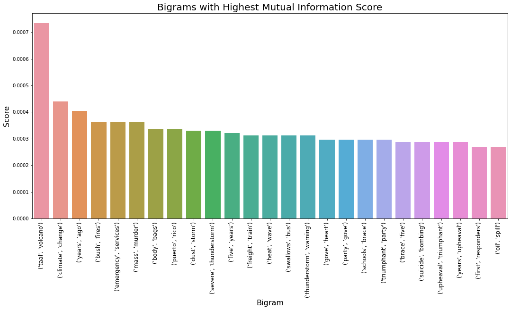

This definitely provides ALOT more insight into the relationships between the words in the text.  We can start to see certain patterns emerge that begin to show phrases that seem to be associated with disasters.  

The next step in our Basic NLP journey was to fit a Word2Vec model on our text in order to further explore the relationships between words. 

```python
w2v_text = [cleaned_explore_text]

wv_model = Word2Vec(w2v_text, size = 100, window = 5, min_count = 1, workers = 4)
wv_model.train(w2v_text, total_examples = wv_model.corpus_count, epochs = 10)
wv_model
```

Admittedly, we had some fun wasting time on exploring the various methods associated with the Word2Vec model, especially the .most_similar() method.  Below are a few examples of being able to find various relationships between words from the text and  what we determined to be "Disaster Keywords".

<b><u>Fire</b></u>
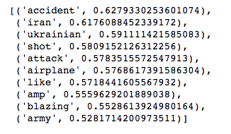

ADD OTHERS HERE

### Classifier Models
We decided early on to run several different types of supervised classifcation models and feed the best of them into a Stacking Classifier to achieve the best results possible.  As you'll soon see, we were pretty surprised at the actual results.  Below is the code for the best model as well as the results.  

#### Logistic Regression
```python
params = {'class_weight': ['balanced'],
          'solver': ['lbfgs', 'liblinear'],
          'C': [1.0, 3.0, 5.0]}
grid = GridSearchCV(estimator = LogisticRegression(), 
                    param_grid = params, 
                    cv = 3, 
                    n_jobs = -1)
grid.fit(X_train_processed, y_train)

# Fit the best model
best_logreg_params = grid.best_params_
best_logreg_model = LogisticRegression(**best_logreg_params)
best_logreg_model.fit(X_train_processed, y_train)

# Evaluate model
evaluate_classifier(best_logreg_model, X_test_processed, y_test)
```

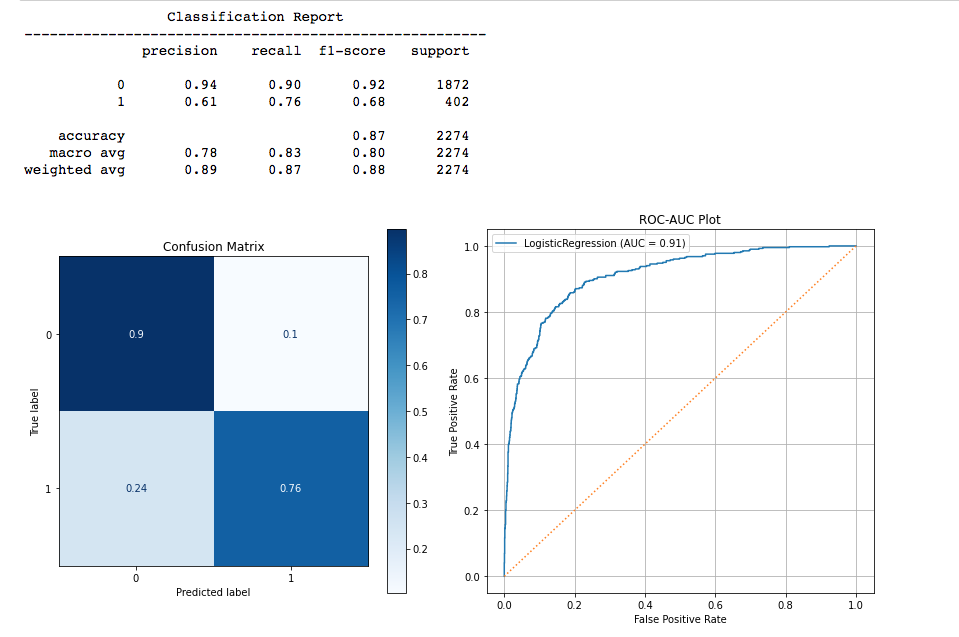

#### SGD
```python
params = {'class_weight': ['balanced'],
          'random_state': [30],
          'loss': ['hinge', 'perceptron'],
          'penalty': ['l1', 'l2']}
grid = GridSearchCV(estimator = SGDClassifier(), 
                    param_grid = params, 
                    cv = 3, 
                    n_jobs = -1)
grid.fit(X_train_processed, y_train)

# Fit the best model

best_sgd_params = grid.best_params_
best_sgd_model = SGDClassifier(**best_sgd_params)
best_sgd_model.fit(X_train_processed, y_train)

# Evaluate model
evaluate_classifier(best_sgd_model, X_test_processed, y_test)
```


#### Random Forest
```python
# Gridsearch for Random Forest
params = {'class_weight': [None, 'balanced'],
          'random_state': [30],
          'criterion': ['gini', 'entropy'], 
          'max_depth': [3, 5, 10], 
          'min_samples_leaf': [1, 5, 10]}
grid = GridSearchCV(estimator = RandomForestClassifier(),
                    param_grid = params, 
                    cv = 3, 
                    n_jobs = -1)
grid.fit(X_train_processed, y_train)

# Fit a new model with the best paramaters from GridSearchCV
best_rf_params = grid.best_params_
best_rf_model = RandomForestClassifier(**best_rf_params)
best_rf_model.fit(X_train_processed, y_train)

# Evaluate the model
evaluate_classifier(best_rf_model, X_test_processed, y_test)
```


#### Stacking Classifier
```python
# Fit the stacking classifier
estimators = [('logreg', logreg),
              ('sgd', best_sgd_model)]
             # ('rf', best_rf_model)]
#               ('xg', best_xgb_model)]

stack = StackingClassifier(estimators = estimators, cv = 3, n_jobs = -1)
stack.fit(X_train_processed, y_train)

# Evaluate the model
evaluate_classifier(stack, X_test_processed, y_test)
```

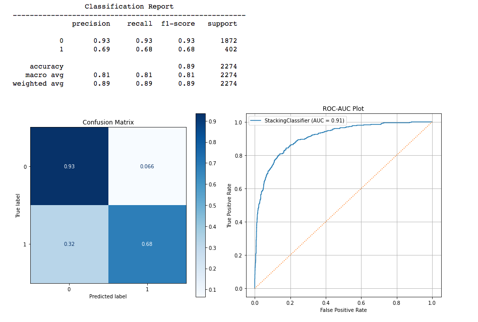

As you can see above, the best peforming model was the simple Logistic Regression...and by quite a bit too!  Since Logistic Regression wins the battle of the classifiers, we'll use this model later on for interpretations.  

### Neural Networks
The neural networks in this section represent the results of a HIGHLY iterative process where we attempted literally hundreds of combinations of layers, parameters, preprocessing methods, optimizers, activation functions, and basically any tunable paramter you can think of.  Results varied greatly and we also encountered an odd phenomenon where the model would seem to be highly accurate but would not produce accurate predictions.  The following represents a compromise between getting decent predictions and allowing a bit of overfitting.  This is something that will be rectified in later versions of this notebook. 

#### First Attempt
This requires a bit of a different preprocessing method, so we will detail this below first. 

##### Preprocessing - The First Attempt
```python
# Remove Stop words 
text_data = [word for word in text_data if word not in stop_words_list]

# Create & fit a tokenizer
tokenizer = Tokenizer()
tokenizer.fit_on_texts(text_data)

# Create a text sequence
X = tokenizer.texts_to_sequences(text_data)
X = sequence.pad_sequences(X)

# Save the length of X
sequence_length = X.shape[1]

# Save words
word_index = tokenizer.index_word
reverse_index = {v:k for k, v in word_index.items()}
```

This worked fairly well and next was dealing with class imbalances in the target.  After trying several methods, we went with assigning a weight to pass into the compile of our nodel.  

```python
from sklearn.utils.class_weight import compute_class_weight

weights = compute_class_weight('balanced', np.unique(y_train_nn), y_train_nn)
weights = dict(zip(np.unique(y_train_nn), y_train_nn))
weights
```

##### LSTM Model
Below is an LSTM sequence model and this represents the final result (best model) of many, many iterations of various combinations of architectures and hyperparameters.  

```python
# Early Stopping 
callback = EarlyStopping(monitor = 'val_acc', patience = 5, mode = 'max', 
                         min_delta = .01, restore_best_weights = True)

# Create a base neural network
model = Sequential()

# Embedding layer
model.add(Embedding(input_dim = len(tokenizer.word_index) + 1, 
                           input_length = sequence_length, 
                           output_dim = 1000))

model.add(SpatialDropout1D(0.3))

# Hidden Layers
model.add(Bidirectional(LSTM(activation = 'relu', units = 128, dropout = 0.3, 
                             recurrent_dropout = 0.3, kernel_regularizer = regularizers.l2(.1))))
model.add(Dropout(0.3))

model.add(Dense(64, activation = 'relu'))
model.add(Dropout(0.3))

model.add(Dense(32, activation = 'relu'))
model.add(Dropout(0.3))

# Output layer
model.add(Dense(1, activation = 'sigmoid'))

# Compile
model.compile(optimizer = 'RMSProp', loss = 'binary_crossentropy', metrics = ['acc'])

# Fit model
history = model.fit(X_train_nn, y_train_nn, batch_size = 50, epochs = 25, 
                    validation_data = (X_test_nn, y_test_nn), callbacks = callback)#, class_weight = weights)#validation_split = 0.3,

# Evaluating the model 
network_eval_plots(history)
```

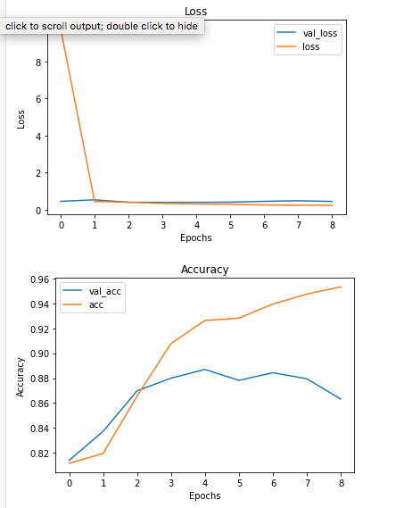

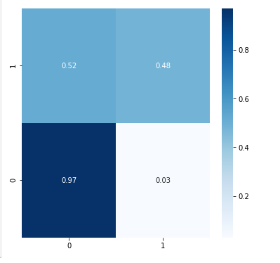

As we can see, this didn't perform well in terms of recall, which is our primary scoring metric.  

##### GRU Model
Out of sheer curiosity, we wanted to see if a GRU model would do any better.  

```python
from tensorflow.keras.layers import GRU

# Early Stopping 
callback = EarlyStopping(monitor = 'val_acc', patience = 3, mode = 'max', 
                         min_delta = .1, restore_best_weights = True)

# Create a base neural network
model2 = Sequential()

# Embedding layer
model2.add(Embedding(input_dim = len(tokenizer.word_index) + 1, 
                           input_length = sequence_length, 
                           output_dim = 100))
model2.add(SpatialDropout1D(0.3))

# Hidden Layers
model2.add(Bidirectional(GRU(activation = 'tanh', units = 200, recurrent_dropout = 0.3, 
               kernel_regularizer = regularizers.l2(.1))))
model2.add(Dropout(0.3))

model2.add(Dense(activation = 'tanh', units = 64))
model2.add(Dropout(0.3))

model2.add(Dense(activation = 'tanh', units = 32))
model2.add(Dropout(0.3))

model2.add(LeakyReLU(alpha = 0.1))
model2.add(Dropout(0.3))

# Output layer
model2.add(Dense(1, activation = 'sigmoid'))

# Compile
model2.compile(optimizer = 'RMSProp', loss = 'binary_crossentropy', metrics = ['acc'])

# Fit model
history2 = model2.fit(X_train_nn, y_train_nn, batch_size = 15, epochs = 25, 
                    validation_data = (X_test_nn, y_test_nn), callbacks = callback) #class_weight = weights)validation_split = 0.2

# Checking the accuracy of the model 
network_eval_plots(history2)
```

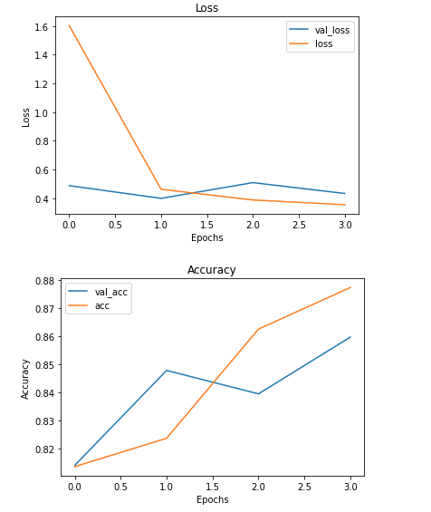

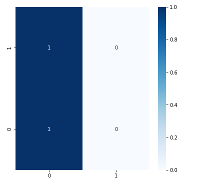

This model didn't do well at all.  For some reason, it was not making predictions with the same accuracy that the model was claiming to be performing at.  This was an issue that we continuously ran into with both LSTM and GRU models during this phase. 

#### Second Attempt
After what seemed like an eternity of reworking the previous neural networks with no improvement in either accuracy or the predictions issue, we decided to start fresh with a different method of preprocessing to see if maybe the issue was pre-modeling.  The neural network below was less iterative than the previous models as it was more of an experiment in preprocessing.

##### Preprocessing - The Sequel
The first preprocessing step that we decided to try was to use functions to clean the text "manually".  In the interest of not bogging down the readme, we won't print all the code here.  Feel free to check out the Functions section in the notebook.  

```python
# Create a new X & y and do "manual preprocessing"

X = df['text'].copy()
y = df['target'].copy()

X = X.map(lambda x: remove_url(x))
X = X.map(lambda x: remove_html(x))
X = X.map(lambda x: remove_emoji(x))
X = X.map(lambda x: remove_punctuation(x))
X = X.map(remove_stopwords)
X
```

Next, we created a counter as an alternative to FreqDist.

```python

from collections import Counter

def counter_word(text):
    count = Counter()
    for i in text.values:
        for word in i.split():
            count[word] += 1
    return count
    
# Implement the counter function

counter = counter_word(X)
print('Total Number of Words:', len(counter))
counter    
```

After the counter, we did a train/test split, created a tokenizer and word sequences.

```python
X_train, X_test, y_train, y_test = train_test_split(X, y, test_size = 0.2, random_state = 30)

tokenizer = Tokenizer(num_words = num_words)
tokenizer.fit_on_texts(X_train)

word_index = tokenizer.word_index

train_sequences = tokenizer.texts_to_sequences(X_train)
train_padded = pad_sequences(train_sequences, maxlen = max_length, padding = 'post', truncating = 'post')

test_sequences = tokenizer.texts_to_sequences(X_test)
test_padded = pad_sequences(test_sequences, maxlen = max_length, padding = 'post', truncating = 'post')
```

We felt that the results of this method of preprocessing seemed to produce a cleaner final dataset.  Let's see how the model feels about it. 

##### LSTM Model - The Sequel
```python
# Early Stopping 
callback = EarlyStopping(monitor = 'val_acc', patience = 5, mode = 'max', 
                         min_delta = .01, restore_best_weights = True)

# Create a base neural network
model4 = Sequential()

# Embedding layer
model4.add(Embedding(input_dim = len(word_index) + 1, 
                           input_length = max_length, 
                           output_dim = 1000))
model4.add(SpatialDropout1D(0.3))

# Hidden Layers
model4.add(Bidirectional(LSTM(activation = 'relu', units = 128, dropout = 0.3, 
                             recurrent_dropout = 0.3, kernel_regularizer = regularizers.l2(.1))))
model4.add(Dropout(0.3))

model4.add(Dense(64, activation = 'relu'))
model4.add(Dropout(0.3))

model4.add(Dense(64, activation = 'relu'))
model4.add(Dropout(0.3))

model4.add(Dense(32, activation = 'relu'))
model4.add(Dropout(0.3))

model4.add(LeakyReLU(alpha = 0.1))
model4.add(Dropout(0.3))

# Output layer
model4.add(Dense(1, activation = 'sigmoid'))

# Compile
model4.compile(optimizer = 'RMSProp', loss = 'binary_crossentropy', metrics = ['acc'])

# Fit 
history4 = model4.fit(train_padded, y_train, batch_size = 50,
                      epochs = 25, validation_data = (test_padded, y_test), callbacks = callback)

# Evaluate
network_eval_plots(history4)
```

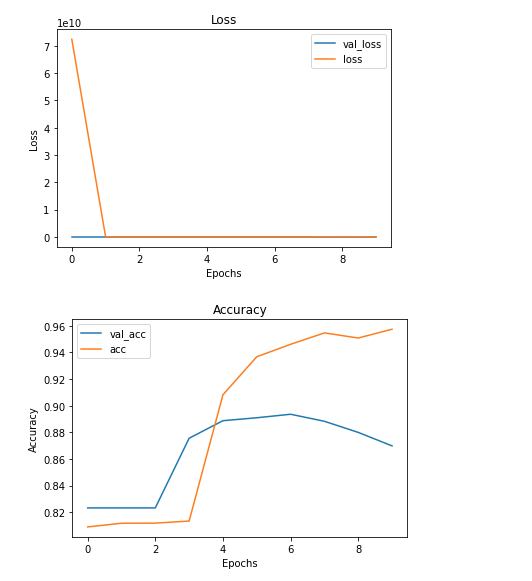

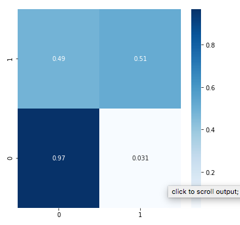

This performed slightly better than the first time, but definitely still needs work.  Admittedly, we had less time to spend fine tuning this model and it will continue to be a work in progress. 


## Results

### Here are examples of how to embed images from your sub-folder


#### SHAP Summary Bar Plot
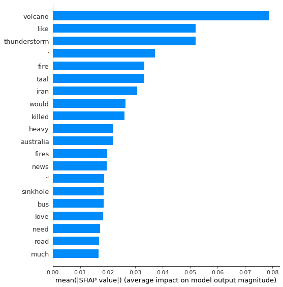
> This showss the top words in terms of importance when determining whether or not a tweet is disaster related.

#### SHAP Summary Importance Plot
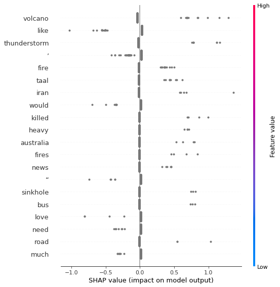
> This plot shows the same list of top words, but also whether they have a negative or positive effect on determining a "disaster tweet"


## Conclusion:
Social media outlets are increasingly becoming a primary outlet for breaking news and the ability to be able to determine whether a post is newsworthy or nonsense is vital to creating awareness of events and if needed, increase the response time for an emergency.  Throughout this notebook, we attempted to create machine learning models that could accurately predict whether or not a tweet was in reference to a disaster.  This model could be deployed as a social media monitor that can take in a series of twweets and determine if it is a "disaster tweet" or just a run of the mill post.  For example, the difference between "The plane crashed." and "We crashed the party.  

### Results
Throughout this notebook, we experimented with using both supervised machine learning methods as well as deep learning methods in order to try to produce the most accurate model possible. 

<b><u>With the conclusion of this experiment, we have achieved the following results:</b></u>
 - <b>Phrases are more significant than single words:</b> When comparing bigrams to common words, the bigrams were much more telling of whether or not a sentence would be in reference to a disaster.<br><br>
 
 - <b>Complexity isn't always better:</b> In this experiment, a simple Logistic Regression model outpeformed highly complex neural networks, and did so in a fraction of the time.<br><br>
 
 - <b> "Disaster" Keywords have the highest feature importance:</b> Words appearing in the top 20 most important include volcano, thunderstorm, fire, fires, killed, sinkhole, etc.

### Recommendations
Based on this analysis, we can make the following recommendations:
- For basic NLP, focus on short phrases that include a "Disaster" Keyword
- In terms of modeling, use a Logistic Regression model.
- Create a supervised machine learning model that focuses on learning short phrases as opposed to single words


## Limitations & Next Steps

With more time, we can improve on this model in the following ways:
- <b>Scrape Additional Data:</b> With more data, we can increase the accuracy of the neural networks.   
- <b>Try Additional Types of Models:</b> There are several different other types of models that we can potentially try and see if we can increase the accuracy of our results. 
- <b>Fine Tuning:</b> We can spend more time tuning our existing models in order to achieve the absolute best results.


### For further information
Please review the narrative of our analysis in [our jupyter notebook](/NLP-Project.ipynb) or review our [presentation](/Mod-4 Presentation.pdf)

For any additional questions, please contact **jeff.spags@gmail.com


##### Repository Structure:

Below is the structure of this repoistory and its contents:

```

├── README.md                       <- The top-level README for reviewers of this project.
├── NLP-Project.ipynb             <- narrative documentation of analysis in jupyter notebook
├── Mod-4 Presentation.pdf                <- pdf version of project presentation
└── images
    └── images                          <- both sourced externally and generated from code

```
